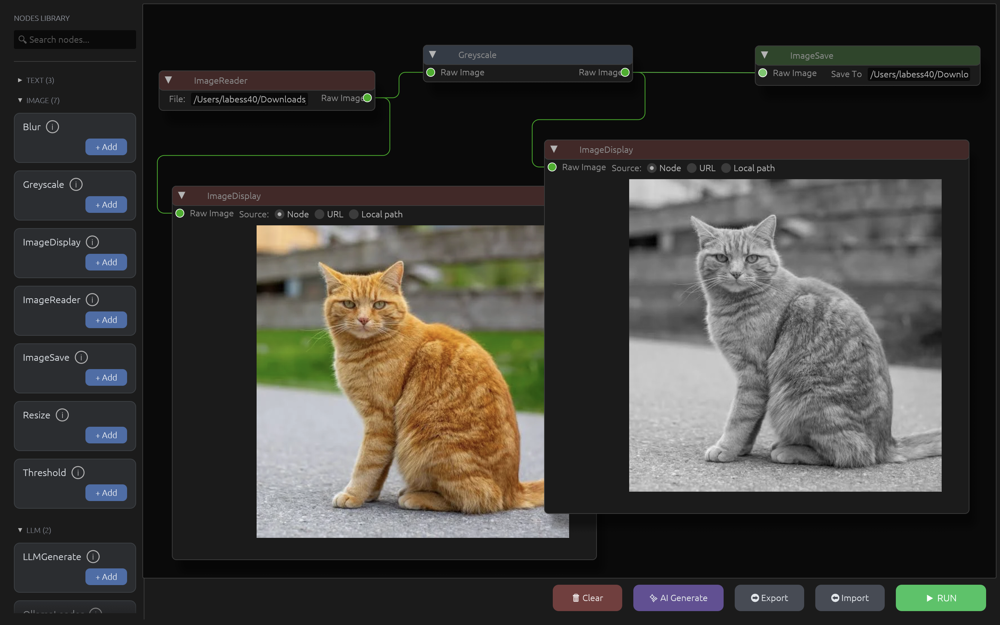

# Chainything

[](https://crates.io/crates/chainything)
[](https://crates.io/crates/chainything-ui)
[](https://github.com/Bessouat40/chainything/actions)



Chainything is a Directed Acyclic Graph (DAG) based pipeline execution engine written in Rust.

It allows you to easily chain complex operations (like image processing, data transformation, etc.) in a modular way. The engine automatically calculates the optimal execution order and handles data transfer between different nodes (processors) while maintaining strong typing for the developer.

## Features

- **Automatic Topological Sorting:** Uses Kahn's algorithm to determine the execution order of processors and detect circular dependencies safely.

- **Strong Typing & Flexibility:** Processors strictly define their input and output types, while the pipeline manages data transfer dynamically via type erasure (Any).

- **Multiple Sources:** Nodes can receive static data (provided at startup) or dynamic data (coming from the output of another node).

- **Extensible:** Simply implement the Processor trait to create your own custom logic blocks.

## Quick Start

### Visual Node Editor

Here's what the UI looks like in action:

### Programmatic Usage

Here is a simple example showing how to load an image, convert it to grayscale, and save it using Chainything:

```rust
use chainything::prelude::*;

fn main() {
    // 1. Initialize the pipeline
    let mut pipeline = Pipeline::new();

    // 2. Add the reader processor (static data input)
    let reader = ImageReaderProcessor::new("reader");
    pipeline.add_processor(
        Box::new(reader),
        vec![InputSource::static_data("./cat.jpg")]
    );

    // 3. Add the grayscale processor (connected to output 0 of "reader")
    let greyscale = GreyScaleProcessor::new("greyscale");
    pipeline.add_processor(
        Box::new(greyscale),
        vec![InputSource::connection("reader", 0)]
    );

    // 4. Add the saver processor (connected to output 0 of "greyscale")
    let saver = ImageSaveProcessor::new("saver", "./output.png");
    pipeline.add_processor(
        Box::new(saver),
        vec![InputSource::connection("greyscale", 0)]
    );

    // 5. Execute the DAG
    match pipeline.execute() {
        Ok(_) => println!("Pipeline executed successfully!"),
        Err(e) => eprintln!("Execution error: {:?}", e),
    }
}
```

## Project Structure

Chainything is split into two main parts:

- **`crates/core`** — The pipeline execution engine and processor library. Pure Rust, no UI dependencies.
- **`crates/ui`** — A visual node editor built with egui that lets you create and execute pipelines graphically.

## Architecture

The project is built around three core concepts:

- **Processor:** A trait you implement to define a logical unit of work (e.g., reading a file, applying a math filter).

- **InputSource:** Defines where the data comes from (Static for hardcoded values, Connection to link to another node's output slot).

- **Pipeline:** The orchestrator that registers processors, analyzes their connections, and executes them in the correct order.

## Getting Started

### Using the Library (Programmatic)

Simply add to your `Cargo.toml` and use the Quick Start example above.

### Using the UI (Visual Node Editor)

```bash
# From the repository root
cargo run --package chainything-ui
```

This launches the visual node editor where you can:

- Add nodes onto the canvas to add processors
- Connect nodes by dragging pins
- Configure processor parameters
- Click "Run" to execute the pipeline

## Development

### Prerequisites

- Rust 1.70+ (install via [rustup](https://rustup.rs/))
- Cargo

### Setup

```bash
# Clone the repository
git clone <repo-url>
cd chainything

# Run tests
cargo test

# Format code
cargo fmt

# Lint
cargo clippy --workspace --all-targets -- -D warnings
```

### Running the UI in Development

```bash
cargo run --package chainything-ui
```

## Creating Your Own Processor

To create a new node in the pipeline, simply implement the Processor trait:

```rust
impl Processor for MyProcessor {
    fn id(&self) -> &str {
        &self.id
    }

    fn set_input(&mut self, inputs: Vec<Arc<dyn Any + Send + Sync>>) -> Result<(), ProcessorError> {
        // Downcast example :
        // let data = inputs[0].downcast_ref::<String>().ok_or(ProcessorError::InvalidInput("...".into()))?;
        Ok(())
    }

    fn get_output(&self) -> Vec<Arc<dyn Any + Send + Sync>> {
        // Return a Vec with your slots output results
        vec![Arc::new("Mon résultat".to_string())]
    }

    fn process(&mut self) -> Result<(), ProcessorError> {
        // Your logic here
        Ok(())
    }
}
```

## Contributing

We welcome contributions! Whether you're adding new processors to the library or improving the UI, please read our [CONTRIBUTING.md](./CONTRIBUTING.md) for detailed instructions on:

- Creating a new processor in `crates/core`
- Creating a corresponding UI node in `crates/ui`
- Testing and documentation requirements
- Submitting a pull request

### Quick Contribution Checklist

1. Create your processor and register it in the pipeline registry
2. Write comprehensive tests and documentation
3. Run `cargo fmt` and `cargo test`
4. (Optional) Create a UI node to expose your processor in the visual editor
5. Submit a PR with both core and UI changes (if applicable)

For detailed guidance, see [CONTRIBUTING.md](./CONTRIBUTING.md).
